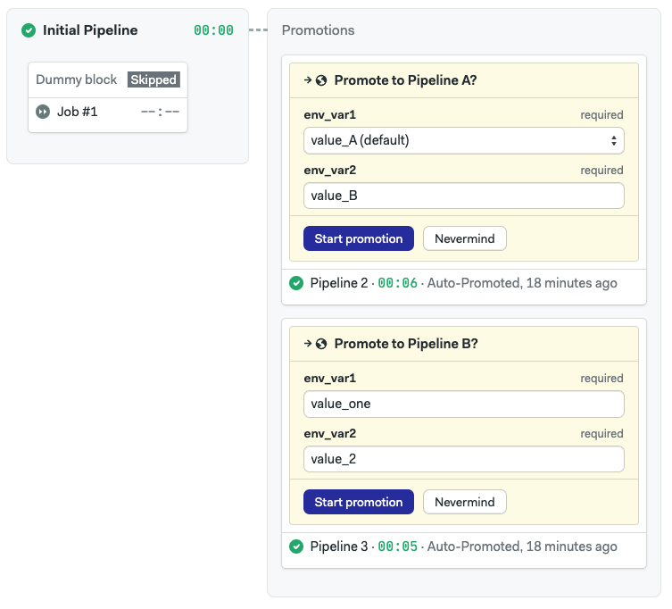

# public
Public repo intended for Semaphore 2.0 usage examples

### Paralle Pipelines branch

Using Parameterized Promotions to create parallel pipelines, using different environment variables, in a same repo

